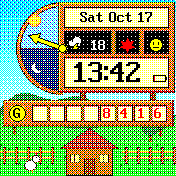

# Stardew Clock

A watch face styled on the Stardew Valley HUD.

## What it shows

* **Day/night dial**: the golden hand points up at 6am, sweeps left through
  the day and reaches the bottom at 2am, just like in the game. It waits
  there until morning.
* **Date**: weekday, month and day.
* **Weather**: the current conditions and temperature from the
  [Weather](https://banglejs.com/apps/#weather) app, if it's installed.
  Without it, the valley is always sunny.
* **Season**: spring, summer, fall or winter, by month (northern hemisphere).
* **Daily luck**: a spirit that's happy, neutral or grumpy. It changes
  once a day.
* **Time**: follows the 12/24 hour setting, with the battery level beside it.
* **Gold**: today's step count.

## Controls

Swipe down to show widgets. Press the button to open the launcher.

## Artwork

The background and icons are drawn with a Pillow script and
converted to 3-bit images with EspruinoWebTools' image converter. The
background uses ordered dithering to approximate the game's browns and
creams on the 8-colour screen.

## Creator

Quackeen
